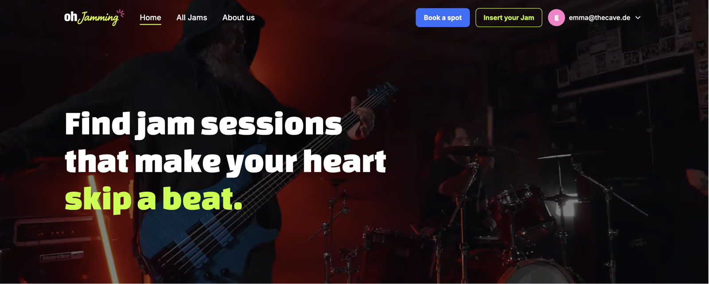
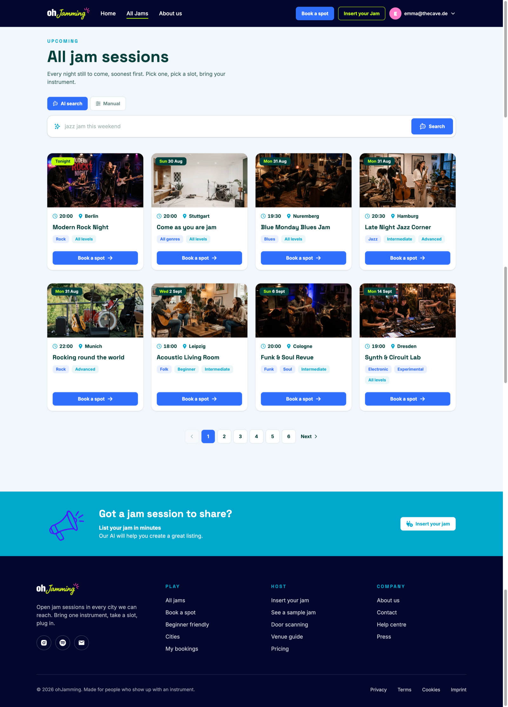
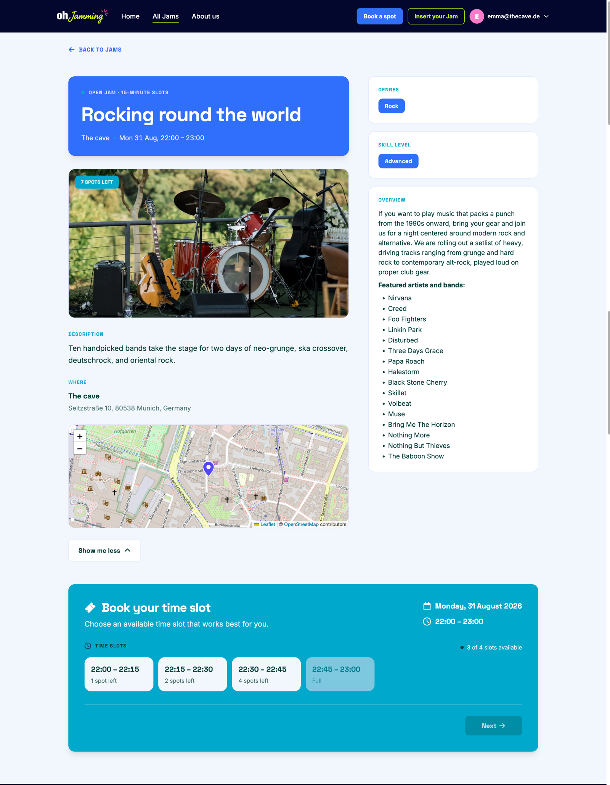
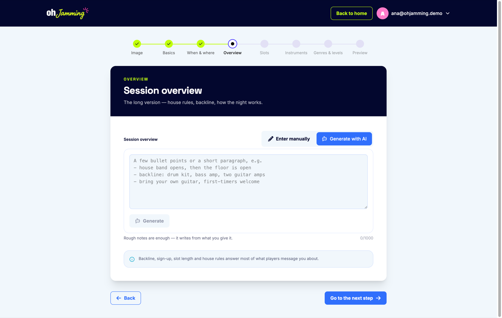
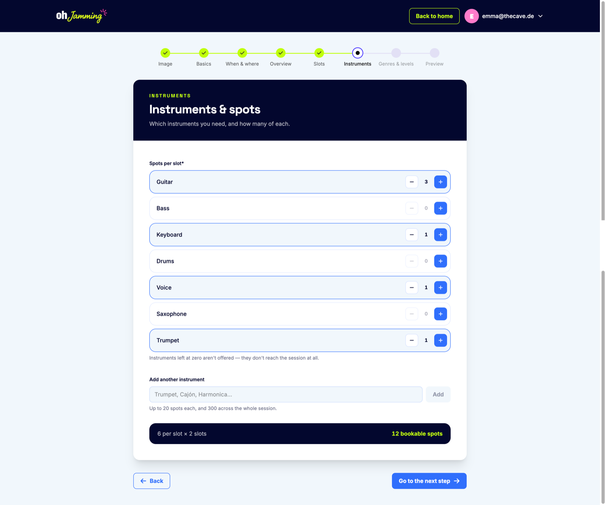
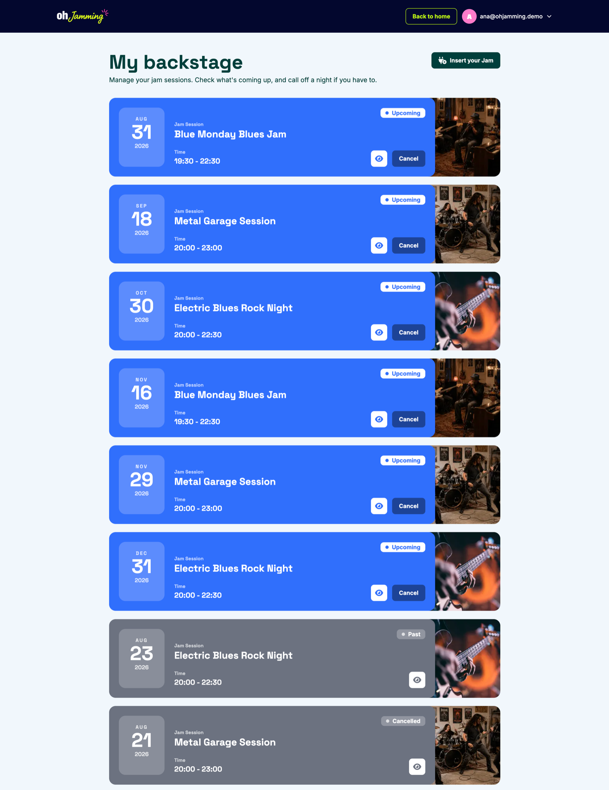
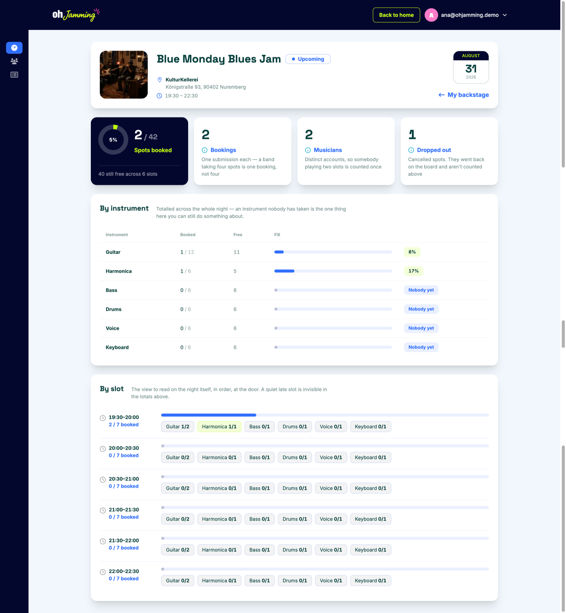
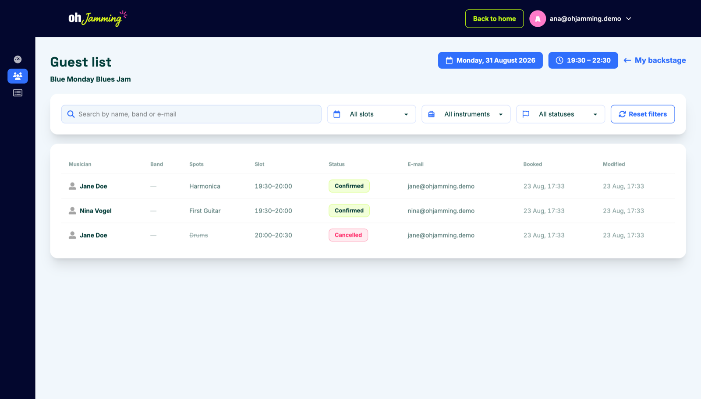
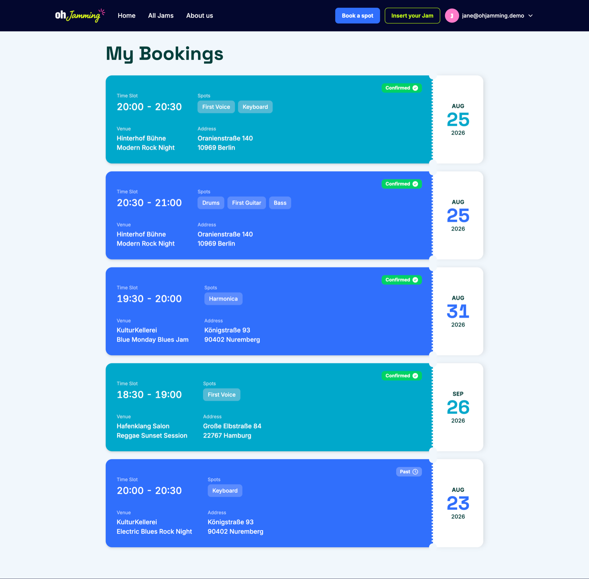
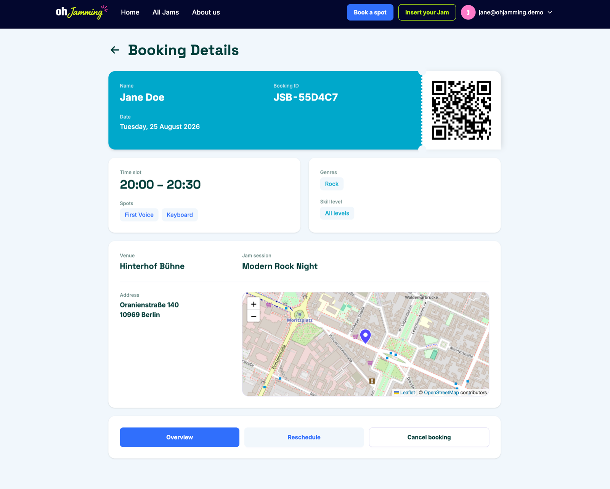

# Oh Jamming

**Open jam nights are hard to find, and harder to run.** A musician who wants to
play tonight is reduced to searching Instagram posts and hoping the lineup isn't
full. The venue hosting the night is running it off a clipboard by the door —
no idea who's coming, which instruments are covered, or whether anyone signed up
for the 22:00 slot at all.

Oh Jamming gives both sides the same board. Venues publish a night broken into
timed slots with a set number of spots per instrument. Musicians browse what's on,
pick a slot, and claim a spot. Everyone can see what's still free.

**Live app:** https://oh-jamming-client.vercel.app
**API repo:** [JimeBlue/oh-jamming-api](https://github.com/JimeBlue/oh-jamming-api)



## Try it

Two seeded accounts, one for each role. The app is role-gated, so most of what
it does is behind a login — use these rather than registering.

| Role | Email | Password |
| --- | --- | --- |
| Venue | `ana@ohjamming.demo` | `demopassword` |
| Musician | `jane@ohjamming.demo` | `demopassword` |

The demo data is shared and live, so anything you create or cancel is visible to
the next person who looks.

## Features

**As a musician**

- Browse every upcoming night — filter by genre, skill level, city and date, or
  describe what you want in a sentence and let the AI search work out the filters
- Read a session's full listing: description, address on a map, and a slot board
  showing exactly which instruments are still open in which half-hour
- Claim one or more spots in a slot, and get a booking with a QR code for the door
- Manage bookings from `/my-bookings` — reschedule to a different slot, or cancel

**As a venue**

- Publish a night through an eight-step wizard: photo, description, address,
  hours, slot length, instruments and spots, genres and skill level, then a
  preview of the exact listing musicians will see
- Let AI draft the description and the summary line from a few rough notes,
  then edit what comes back
- Track the night from the cockpit: spots booked, distinct musicians, drop-outs,
  fill rate per instrument, and a slot-by-slot view to read at the door
- See the guest list, and call off a night — which cancels every booking with it

## Screenshots

**Browsing what's on** — filters, cards, and real server-side paging.
Natural-language search sits alongside the manual filters as a second tab.



**A session's listing** — the same two components a venue previews before
publishing, so what gets approved is exactly what gets shipped.



**Writing the listing with AI** — a venue types rough notes and gets a draft
description back to edit. Generation runs through the API, never the browser.



**Building a night** — step six of eight. The count updates live, and instruments
left at zero never reach the session.



**The venue's board** — upcoming, past and cancelled nights in one place.



**The cockpit** — what a venue needs the week before, and the slot view they read
on the night itself.



**The guest list** — who is coming, and what they're playing.



**A musician's bookings** — every night they've claimed a spot on, as tickets.



**One booking** — slot, spots, venue, map, and the QR code for the door.



## Tech stack

| | |
| --- | --- |
| **Framework** | Next.js 16 (App Router), React 19, TypeScript |
| **Styling** | Tailwind CSS 4, daisyUI 5 with a custom theme |
| **Forms** | React Hook Form + Zod, one schema shared by the form and the API payload |
| **Editor** | Tiptap with markdown serialisation |
| **Maps** | Leaflet / OpenStreetMap |
| **Motion** | Motion (Framer Motion) |
| **Hosting** | Vercel |

The backend is a separate repo — Express 5, MongoDB via Mongoose, Zod validation,
Cloudinary for images and Gemini for the AI features, hosted on Render.

## Architecture

Four decisions, each one a place where the cheaper option would have broken
something later.

- **Auth is three states, not two.** Sessions live in httpOnly cookies on the
  API's domain, so "am I logged in?" costs a round-trip. That makes `loading` a
  real state — collapsing it into "logged out" bounces a signed-in user to
  `/login` on every refresh.
- **The API layer parses, it doesn't assert.** Every request goes through one
  module whose methods take a Zod schema rather than a type parameter, so a
  renamed backend field throws at the boundary instead of spreading `undefined`.
- **Token refresh is single-flight.** The API treats a reused refresh token as
  theft and deletes every session for that user, so a second concurrent refresh
  would log them out everywhere.
- **One listing, rendered in three places.** The musician's page, the builder's
  preview and the venue's panel share the same components — which is what stops
  a venue approving one layout and publishing another.

## Running locally

Requires the [API](https://github.com/JimeBlue/oh-jamming-api) running alongside
it.

```bash
npm install
cp .env.example .env.local
npm run dev
```

Then open http://localhost:3000.

| Variable | Description |
| --- | --- |
| `NEXT_PUBLIC_API_URL` | Base URL of the Oh Jamming API |
| `NEXT_PUBLIC_CLOUDINARY_CLOUD_NAME` | Cloudinary cloud the API uploads to |

`NEXT_PUBLIC_*` variables are inlined at build time, so changing one in a hosting
dashboard needs a redeploy rather than a restart.

| Script | |
| --- | --- |
| `npm run dev` | Dev server on :3000 (Turbopack) |
| `npm run build` | Production build |
| `npm run start` | Serve the production build |
| `npm run lint` | ESLint |

## Roadmap

Deliberately out of scope for the first release, in the order I'd build them.

- **A booking-update endpoint.** Rescheduling currently cancels the old booking
  and creates a new one, because the API has no endpoint that modifies one. It
  works, but it isn't atomic — one `PATCH` would replace the whole dance.
- **An editable listing for venues.** A published night can be cancelled but not
  corrected. The flow is designed and specced; it isn't built.
- **A stats endpoint.** The home page counts open spots by walking the whole
  board over the network. Fine at nine sessions, indefensible at nine hundred —
  it belongs in a single aggregation.
- **Door scanning.** Bookings already carry a QR code; nothing reads it yet.
- **Recurring nights.** Most venues run the same jam every second Monday and
  currently publish it by hand each time.
- **Email notifications** when a night a musician booked is called off. Right now
  they find out by opening the app.
